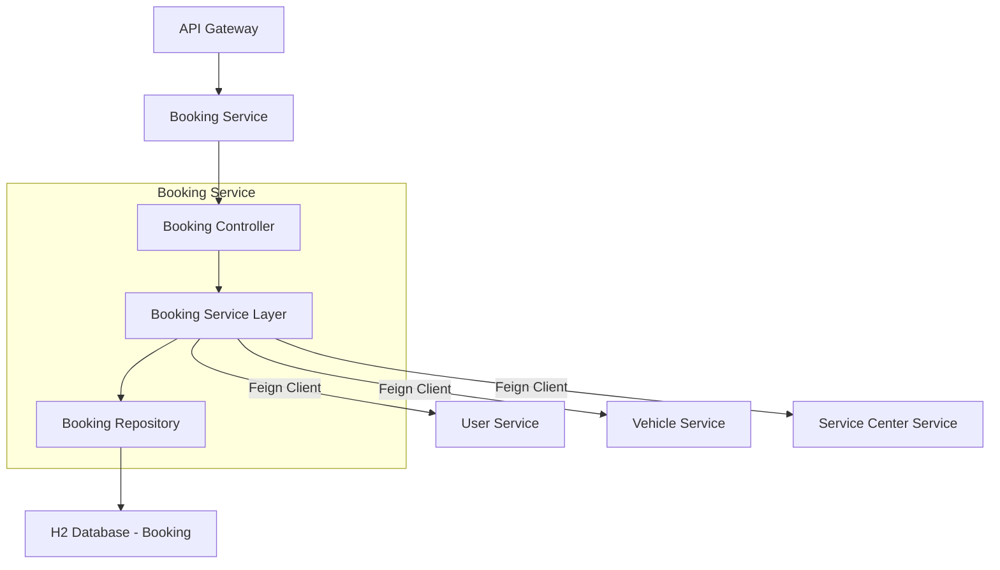

# Service Booking


## Table of Contents

- [Overview](#overview)
- [Component Diagram](#component-diagram)
- [Database Table Design](#database-table-design)
- [Endpoints](endpoints)
- [Key Features](key-features)
- [Sequence Diagram](#sequence-diagram)
- [Swagger Documentation](swagger-documentation)


## Overview

- **Manages**: Service selection, booking creation, availability checks, and booking status tracking.
- **Provides**: RESTful endpoints for creating, updating, canceling, and retrieving bookings.
- **Communication**: Interacts with User Management, Vehicle Management, and Service Center Management modules.

## Component Diagram




## Key Features

- **Service Listing**  
    - Display available services with filters like category, price, and duration.

- **Booking Creation**  
    - Book services with date and time selection.

- **Availability Check**  
    - Ensure time slots are free before confirming bookings.

- **Booking Management**  
    - Cancel, reschedule, and track booking status.

- **User Booking History**  
    - Retrieve all bookings made by a user.

- **Microservice Ready**  
    - Designed for scalability and integration in a distributed system.

## Database Table Design

### Table: `bookings`

| Column Name       | Data Type | Description                                      |
|-------------------|-----------|--------------------------------------------------|
| booking_id        | INT       | Primary key                                      |
| user_id           | INT       | Foreign key to users table                       |
| vehicle_id        | INT       | Foreign key to vehicles table                    |
| service_center_id | INT       | Foreign key to service_centers table             |
| date              | DATE      | Scheduled date                                   |
| time_slot         | TIME      | Scheduled time slot                              |
| status            | VARCHAR   | Booking status (Scheduled, Cancelled, Completed) |

## Endpoints

| Method | Endpoint                                 | Description                          |
|--------|------------------------------------------|--------------------------------------|
| POST   | `/api/bookings`                          | Book an appointment                  |
| DELETE | `/api/bookings/{bookingId}`              | Cancel a booking                     |
| PUT    | `/api/bookings/{bookingId}`              | Reschedule a booking                 |
| GET    | `/api/bookings/{bookingId}/status`       | Track booking status                 |


## Sequence Diagram

```mermaid
 sequenceDiagram
    participant User
    participant API Gateway
    participant BookingService
    participant UserService
    participant VehicleService
    participant ServiceCenterService
    participant BookingDB
 
    User->>API Gateway: POST /api/bookings (BookingRequest)
    API Gateway->>BookingService: Route request
    BookingService->>UserService: Validate user
    BookingService->>VehicleService: Validate vehicle
    BookingService->>ServiceCenterService: Validate service center and type
    BookingService->>BookingDB: Save booking
    BookingDB-->>BookingService: Booking saved
    BookingService-->>API Gateway: Booking confirmation
    API Gateway-->>User: Booking details 
 ```
---
## Swagger Documentation

The Service Booking Module provides interactive API documentation using Swagger.

### Access Swagger UI
- http://localhost:8084/swagger-ui/index.html

